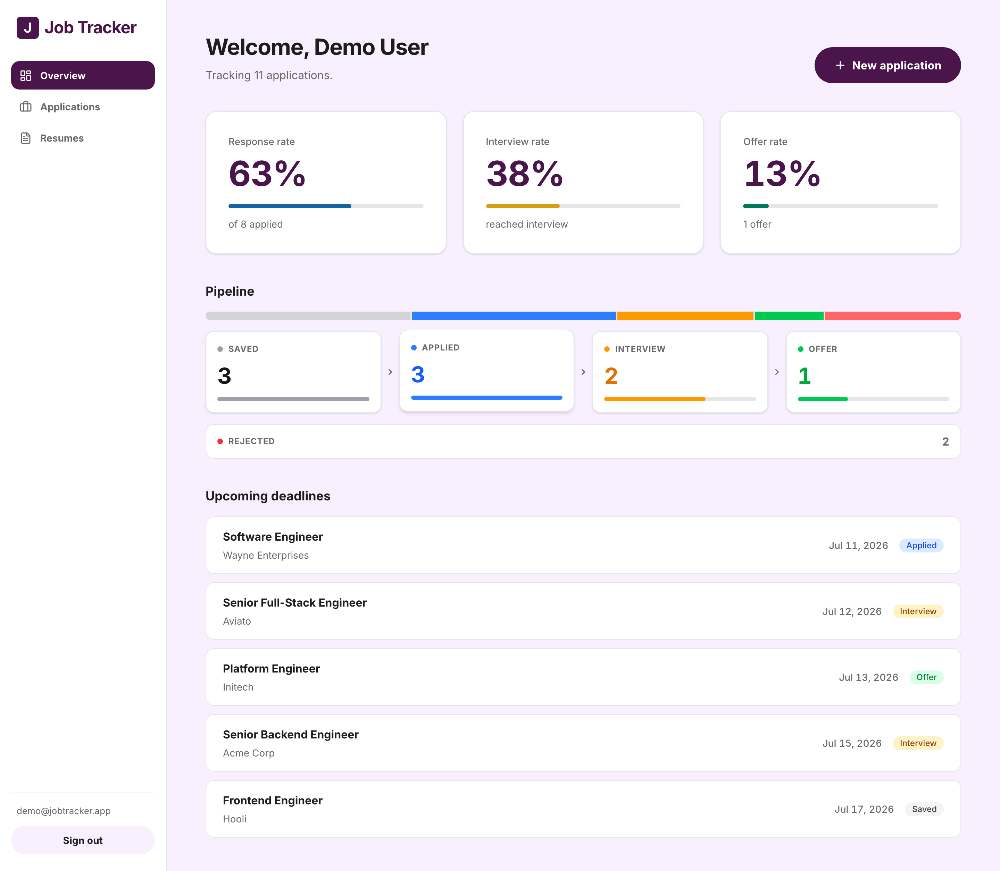
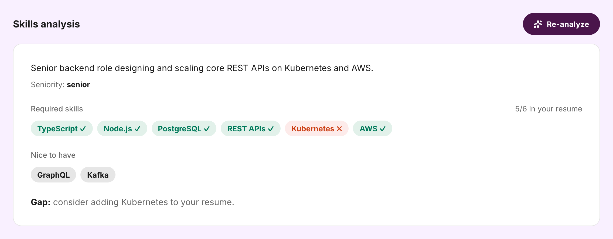
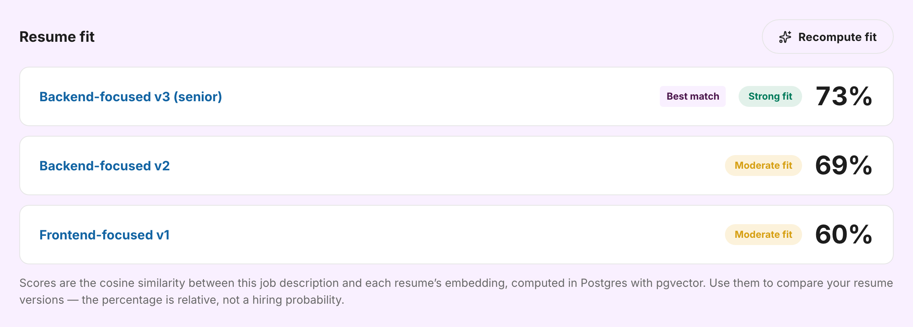

<div align="center">

# 💼 Job Tracker

**A smart job-application tracker that uses AI to analyze job descriptions and tailor your resume — built to manage a real job hunt instead of a spreadsheet.**

[](https://github.com/nkieu-config/job-tracker-app-project/actions/workflows/ci.yml)
[](https://job-tracker-app-project.vercel.app)
&nbsp;


**[Open the live demo →](https://job-tracker-app-project.vercel.app)**

Click **“Try the demo account”** on the sign-in page — or use
`demo@jobtracker.app` / `demotracker2026` — for a pre-populated dashboard.

</div>

---

## 📸 Screenshots

<!--
Capture these with the demo account (Try the demo account → it's pre-populated)
and save them in docs/screenshots/. See docs/screenshots/README.md for what each
shot should show. Recommended width ~1400px; use a GIF for the streaming one.
-->

<div align="center">

**Dashboard — applications by status & upcoming deadlines**



<br />

**AI job-description analysis + skill gap**



</div>

| Resume fit ranking (pgvector) | Bullet tailoring (streamed live) |
| :---: | :---: |
|  |  |

## Features

- **Auth & accounts** — email/password sign up / sign in; every piece of data is scoped to the signed-in user.
- **Application tracker** — full CRUD for applications with status (Saved → Applied → Interview → Offer → Rejected), deadlines, notes, and a dashboard that counts by status and surfaces upcoming deadlines.
- **Resume versions** — upload PDF resumes; text is extracted and stored for the AI features.
- **AI · JD analysis + skill gap** — Gemini extracts required skills, nice-to-haves, seniority, and a summary from a job description, then highlights which required skills are missing from your resume.
- **AI · resume fit score** — embeds the JD and your resumes and ranks each resume version by cosine similarity using **pgvector**.
- **AI · bullet tailoring (streaming)** — rewrites your experience into resume bullets tuned to the JD, streamed token-by-token.

## Tech stack

| Layer | Choice |
| --- | --- |
| Framework | Next.js 16 (App Router, Server Actions) + TypeScript |
| UI | Tailwind CSS v4 |
| Database | PostgreSQL (Neon) + Prisma 7 (driver adapter) + pgvector |
| Auth | Better Auth (sessions in Postgres) |
| File storage | Vercel Blob (private) |
| AI | Google Gemini 2.5 Flash (generation) + `gemini-embedding-001` (embeddings) |
| Validation | Zod |
| Testing / CI | Vitest + Testing Library, GitHub Actions |
| Hosting | Vercel |

## Architecture notes

- **Defense-in-depth auth.** A `proxy.ts` (Next 16's renamed middleware) does an optimistic cookie check, but every page, Server Action, and route handler independently re-checks the session and scopes queries by `userId` — middleware is never the only gate (see CVE-2025-29927).
- **Two-layer AI validation.** The JSON schema Gemini must follow is derived from a Zod schema (`z.toJSONSchema`), and the response is re-validated with that same schema, so malformed model output never reaches the UI.
- **pgvector via raw SQL.** Vector columns are declared `Unsupported("vector(768)")` so Prisma tracks them without drift; embeddings are written and ranked with raw SQL (`<=>` cosine operator, HNSW index).

## Local setup

```bash
# 1. Install deps (postinstall runs `prisma generate`)
npm install

# 2. Configure environment
cp .env.example .env   # then fill in the values below

# 3. Apply migrations to your database
npx prisma migrate dev

# 4. Run
npm run dev            # http://localhost:3000
```

### Environment variables

See [.env.example](.env.example). `.env` is gitignored — never commit secrets.

- `DATABASE_URL` / `DIRECT_URL` — Neon Postgres connection strings (the app uses the direct one; see Challenges).
- `BETTER_AUTH_SECRET` — random secret (`openssl rand -base64 32`).
- `BETTER_AUTH_URL` — `http://localhost:3000` locally; your deployment URL in prod.
- `BLOB_READ_WRITE_TOKEN` — from a Vercel Blob store (`vercel env pull`).
- `GEMINI_API_KEY` — free key from [Google AI Studio](https://aistudio.google.com/apikey).

### Scripts

```bash
npm run dev         # dev server
npm run build       # production build
npm run lint        # eslint
npm run typecheck   # tsc --noEmit
npm test            # vitest
npm run seed        # populate the demo account (server must be running)
```

To verify a running deployment by hand, follow [docs/manual-qa.md](docs/manual-qa.md).

### Demo account

`npm run seed` creates `demo@jobtracker.app` / `demotracker2026` with sample
applications, a resume, and a pre-computed JD analysis so the live demo is
never empty. Start the server first (`npm run start &`), then run the seed.

## Deploy (GitHub → Vercel → Neon)

1. **Neon** — create a free Postgres project; copy both the pooled and direct connection strings.
2. **Vercel Blob** — create a Blob store (Storage → Create → Blob); it adds `BLOB_READ_WRITE_TOKEN` to the project.
3. **GitHub** — push the repo.
4. **Vercel** — import the repo and set all env vars above (`BETTER_AUTH_URL` = your production URL). Every push deploys automatically.
5. Apply migrations to production: `npx prisma migrate deploy`.

## Challenges & solutions

- **Prisma 7 dropped the bundled query engine.** It now requires a driver adapter, so the client uses `@prisma/adapter-pg` and the datasource URL lives in `prisma.config.ts`, not the schema.
- **Neon's pooled endpoint broke node-postgres TLS.** Its multi-label hostname isn't covered by Neon's wildcard cert, and the driver can't both send SNI for routing and skip verification. Diagnosed down to the cert SAN / SNI error; the app uses the direct connection with `uselibpqcompat` (encrypt without hostname verification, Neon's documented `sslmode=require` behavior).
- **Better Auth pulled a broken kysely.** kysely `0.29.2` stopped re-exporting a symbol the adapter imports; pinned to `0.28.17` via an npm `override`.
- **Next 16 renamed `middleware` → `proxy`.** Read the bundled Next docs and used the new `proxy.ts` convention (which also reinforces the data-layer auth checks above).
- **Trusting AI output.** Gemini occasionally returns off-schema JSON; the Zod round-trip (schema-out, validate-in) makes the failure explicit and recoverable instead of crashing the page.
- **Private resumes.** Resume PDFs are stored in a private Blob and streamed only through an authenticated, ownership-scoped route — the blob URL is never public.

See [the build plan](docs/job_tracker_build_plan.md) for the full phase-by-phase plan.
