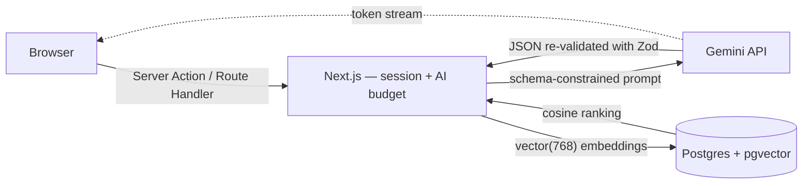
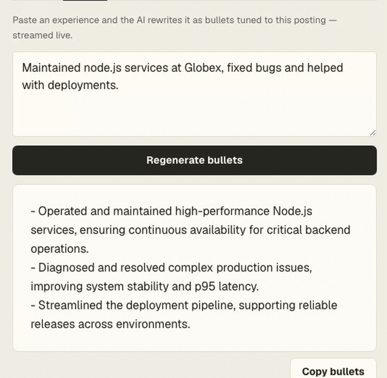
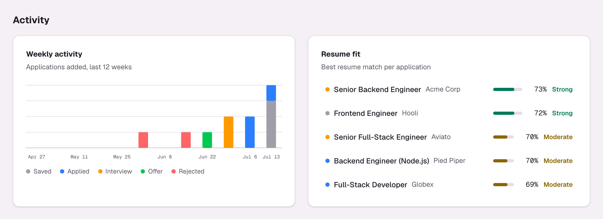
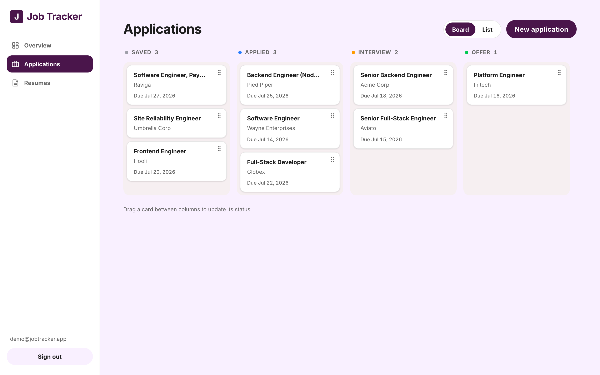
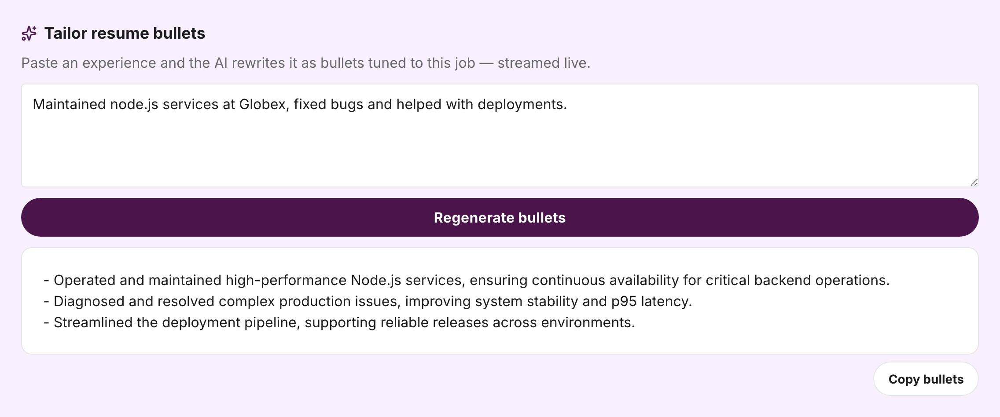
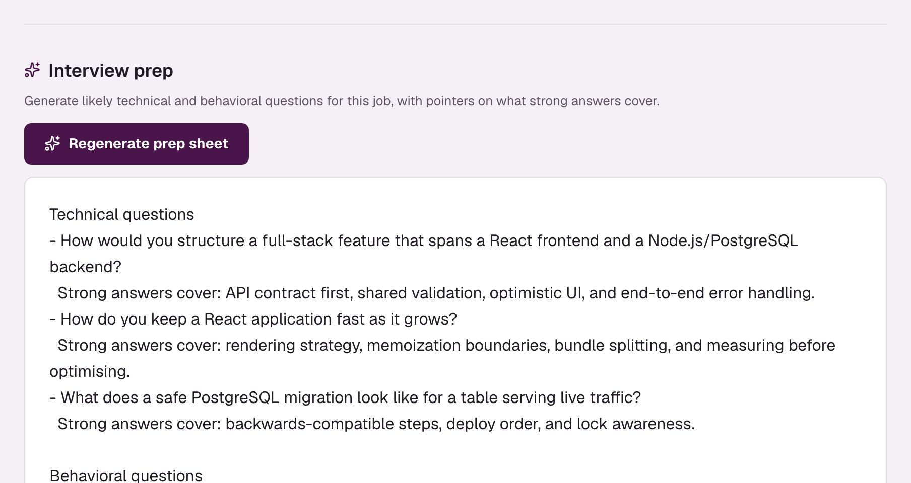
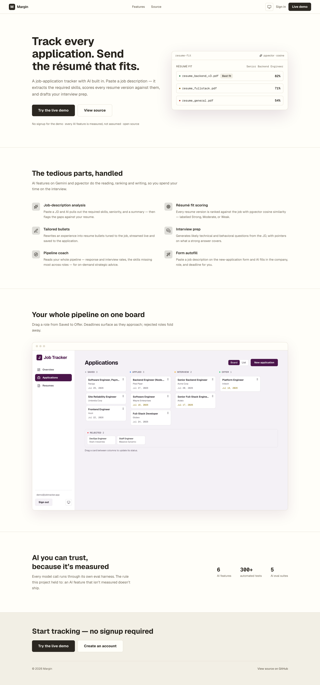

# Job Tracker 💼

[](https://github.com/nkieu-config/job-tracker/actions/workflows/ci.yml)
[](https://job-tracker-app-project.vercel.app)
[](LICENSE)

**The job hunt is a data problem. This is the tool I built to solve mine.** An AI-powered job-application tracker that analyzes job descriptions, scores your resume versions against them with vector embeddings, and tailors your bullets — built solo as my capstone project, used daily in my real job search.

**6 AI features, each with an eval suite · 381 tests + a 6-suite AI eval harness · ~14k lines of strict TypeScript (app, tests, evals)**


## Try it in 60 seconds

**🔗 Live demo: [job-tracker-app-project.vercel.app](https://job-tracker-app-project.vercel.app)** — click **Try Live Demo** on the homepage (no signup), or sign in directly:

| Field        | Value                 |
| ------------ | --------------------- |
| **Email**    | `demo@jobtracker.app` |
| **Password** | `demotracker2026`     |

Then open **Applications → Senior Backend Engineer (Acme Corp)**: the skill-gap chips show **5 of the 6 required skills matched**, with Kubernetes flagged as the gap; **Resume fit** ranks the three resume versions by cosine similarity, putting the backend-focused one on top as a Strong fit; and **Tailor resume bullets** regenerates live, token by token.

> [!NOTE]
> The demo account is shared and public — anything you change is visible to other visitors until the nightly reseed, and all AI actions on it draw from one 30-calls-per-hour budget.

Prefer to run it yourself? A `.env` and a few commands — see [Quick start](#quick-start).

## Why I built this

I was a graduating student staring down my first job search, tracking twenty applications in a spreadsheet. Every new posting meant the same manual loop: re-read the job description, guess which skills I was missing, decide which of my three resume versions fit best, and rewrite my bullets to match — with no way to tell if any of it was working.

So for my graduation project I built the tool I wished I had: a tracker where the pipeline is a Kanban board instead of spreadsheet rows, and where the tedious parts — skill-gap analysis, resume-to-JD matching, bullet rewriting, interview prep — are done by AI in seconds instead of by me at 1 a.m.

The rule I held myself to: **an AI feature that isn't measured doesn't ship.** That's why this repo contains an evaluation harness with precision/recall numbers, not just prompts.

The result is the app I now use to run the very job search it was built for. If you're reading this as a recruiter: the product *is* the cover letter.

## What happens when you analyze one job description

1. A Server Action re-verifies your session (middleware is never the only gate) and checks the per-user hourly AI budget before any model call.
2. `server/ai` calls Gemini with a JSON schema **derived from a Zod schema**, then re-validates the response with that same schema — malformed model output becomes a recoverable error message, never a crashed page. The stored result carries a content-hash fingerprint (description + model + prompt version), so re-analyzing an unchanged description skips the model call and only refreshes the skill matching.
3. Extracted skills are matched against your resumes in two layers: word-boundary + alias matching first, then embedding similarity for paraphrases — "GitHub Actions pipelines" counts as CI/CD. That second layer's contribution is measured, not assumed.
4. Computing fit embeds the JD and any new resume versions in one batched call, stores them in `vector(768)` columns, and ranks versions with a single cosine-distance SQL query behind an HNSW index.
5. Every model call is recorded — tokens and cost roll up per feature on an admin AI-usage page.



Full deep-dive — system design, data model, decision rationale, challenges-and-solutions log: [docs/architecture.md](docs/architecture.md).

## Engineering decisions I'd defend in an interview

- **The LLM is treated as untrusted input.** The JSON schema Gemini must follow is *derived from* a Zod schema, and the response is re-validated with that same schema — one source of truth for prompting and validation, defined once in `src/lib/schemas/`.
- **The AI is measured, not assumed.** Every feature has to clear an [evaluation harness](evals/) — real metrics, a controlled ablation, and an LLM judge — before it ships. Scorecard below.
- **Defense-in-depth auth.** Middleware does an optimistic cookie check, but every page, Server Action and route handler independently re-verifies the session and scopes queries by `userId` — a design that survives CVE-2025-29927, the Next.js middleware bypass.
- **Vector search in the database, not the app.** Embeddings live in Postgres `vector(768)` columns behind an HNSW index; resume ranking is one raw-SQL cosine-distance query, not an application-side similarity loop.
- **Charts are hand-rolled SVG, not a charting library.** The dashboard's weekly-activity bars and fit ranking are built from primitives (pure bucketing/scale helpers, unit-tested) so they inherit the design tokens — theme-aware in light and dark, keyboard-navigable with an `sr-only` data table — and add zero KB to the bundle.
- **AI behind one boundary.** All Gemini access lives in a single `server/ai/` module called only from server code, so the API key never reaches the client and there is exactly one place to meter, validate and mock.
- **Streaming end to end.** Gemini's chunk iterator is piped straight into a Route Handler `ReadableStream` → browser, with an end-of-stream status frame so a dropped connection can never silently persist a truncated result.
- **Production paper cuts, actually fixed.** Serverless connection exhaustion (now a capped `pg` pool, drained before each Fluid instance suspends), a broken transitive Kysely release pinned with an npm override, Prisma 7's engine removal, Next 16's `middleware` → `proxy` rename — the full list with solutions is in [docs/architecture.md](docs/architecture.md#challenges--solutions).

### AI eval scorecard

Regenerated with `npm run eval`, on real model calls. Generation runs on `gemini-3.5-flash-lite`, with one exception measured below. The move off `gemini-3.1-flash-lite` was itself decided by the harness — every metric held or improved, and the new model's 500 requests/day (against 20) is what finally makes a full same-day scorecard affordable:

- **Skill matching** — the embedding layer lifts recall from 86.1% to **94.4%** (+8.3 points; F1 90.5% → **95.5%**) over lexical-only matching, in a controlled ablation (embedding-only, unaffected by the generation model).
- **JD analysis** — **90.4% F1** on skill extraction (precision 89.8%, recall **97.8%**), 93.3% seniority accuracy, **100% schema validity** across 15 labeled job descriptions. This is the strongest signal in the model migration: +3.0 F1 and +4.4 recall over `gemini-3.1-flash-lite`, on the largest labeled set here.
- **Pipeline coach** — LLM-judge relevance **5/5**, grounding **5/5**, actionability **4.6/5**, **zero hallucinations**, and **100%** focus-skill grounding: a model-free check that the skill it tells you to prioritise is a gap actually present in the data, across 5 pipelines.
- **Form autofill** — **100%** company, role and deadline accuracy (exact match) and **100% schema validity** across 6 job descriptions, scored deterministically with no judge.
- **Bullet tailoring** — the eval caught the lite model fabricating specifics on this task (grounding 3.83/5, below the gate), so tailoring alone runs on the stronger **`gemini-3.5-flash`** with a prompt tightened to bar unsupported qualifiers. Its fresh scorecard on the new stack is being re-captured; the retired 2.5-flash's earlier 4.83 / 4.67 / 5 no longer applies.
- **Interview prep** — LLM-judge relevance **5/5**, grounding **5/5**, actionability **5/5**, with a model-free check that the sheet obeys its contract (three sections, 5-7 technical questions, 3 behavioral, 3 to ask back, each with an answer key) at **100%** structural validity, **100%** answer-key coverage and **zero hallucinations**, across 5 roles. On the previous model this suite caught a real slip — a 3+-year Frontend Engineer role over-levelled to "senior" — which is gone on the current one. Its first run also flagged that the *judge* was over-strict, counting on-topic questions as fabrication; that tightened the metric, not the model.

The judged suites (tailoring, coach, interview) are scored by a separate LLM judge (`gemini-3.5-flash` by default, a different model from the one under test; `EVAL_JUDGE_MODEL` overrides it). Full methodology and per-suite results: [evals/](evals/).

## Feature tour

| Module               | What it does                                                                                                                      |
| -------------------- | --------------------------------------------------------------------------------------------------------------------------------- |
| **Kanban pipeline**  | Drag-and-drop board (Saved → Applied → Interview → Offer → Rejected), optimistic updates, URL-synced list with search/filter/sort |
| **Dashboard**        | Response, interview and offer rates, pipeline funnel, weekly-activity chart, resume-fit ranking, skill-gap insights, upcoming deadlines |
| **JD analysis**      | Gemini extracts required skills, nice-to-haves and seniority, then flags which skills your resumes are missing — cached by content hash |
| **Resume fit**       | Ranks every resume version against the JD by pgvector cosine similarity, labeled with Strong/Moderate/Weak bands                  |
| **Bullet tailoring** | Rewrites your experience into JD-tuned resume bullets, streamed token-by-token, saved per application                             |
| **Interview prep**   | Streamed prep sheet — likely technical and behavioral questions, each with what a strong answer covers                            |
| **Pipeline coach**   | Reads your whole pipeline — rates and the skills missing most across roles — for cached, on-demand strategic advice               |
| **Form autofill**    | Paste a job description on the new-application form and Gemini fills the company, role and deadline                               |
| **Resume versions**  | PDF upload (content-type and magic-byte checked), text extraction, private Vercel Blob storage                                    |
| **AI observability** | Admin page tracking tokens and cost per AI feature; a shared hourly AI budget per user                                            |

Two of the AI features stream. Here is bullet tailoring as it actually runs — a real recording of the demo account, not a mockup:



<details>
<summary>📸 More screenshots — the board, the AI features, and the landing page</summary>

The dashboard's Activity section — weekly application bars and a resume-fit ranking, both hand-rolled SVG:



The Coaching section — a skill-gap tally across the pipeline beside on-demand AI advice:


Drag a card and the move persists optimistically:



| JD analysis & skill gap | Resume fit ranking |
| --- | --- |
|  |  |

| Bullet tailoring (streamed) | Interview prep (streamed) |
| --- | --- |
|  |  |

Paste a job description on the new-application form and AI auto-fill sets the company, role and deadline:


The design system in [docs/design.md](docs/design.md), as actually rendered:



</details>

Every image on this page is generated from the seeded demo by Playwright — `npm run screenshots` for the stills, `npm run record-demo` for the streaming clip — so none of them can drift from the real UI.

## Tech stack

| Layer     | Choice                                                                              | Why                                                                                    |
| --------- | ----------------------------------------------------------------------------------- | -------------------------------------------------------------------------------------- |
| Framework | Next.js 16 (App Router, Server Actions, Route Handlers) + TypeScript strict         | One framework covers server-rendered pages, mutations and token streaming              |
| AI        | Gemini 3.1 Flash Lite (3.5 Flash for bullet tailoring) + `gemini-embedding-001`, in-process from `server/ai/` | Native JSON-schema output, one vendor for generation + embeddings; the eval harness picks the model per task |
| Database  | PostgreSQL (Neon) + Prisma 7 + pgvector                                             | Vectors live beside the relational rows — ranking is one SQL query, not a second store |
| Auth      | Better Auth (sessions in Postgres; email/password + optional GitHub/Google OAuth)   | Sessions in my own database, scoped by the same `userId` as everything else            |
| UI        | Tailwind CSS v4, semantic design tokens ([design system](docs/design.md))           | Tokens keep 13 pages consistent without pulling in a component library                 |
| Storage   | Vercel Blob (private)                                                               | Resume PDFs are private by default, served only through an ownership-scoped route      |
| Quality   | Zod validation end-to-end · Vitest + Testing Library · AI eval harness · Playwright | The same Zod schemas validate forms, Server Actions and the model's JSON output        |
| Infra     | Vercel + GitHub Actions                                                             | Zero-ops deploys from `main`; CI gates every push                                      |

## Quick start

<details>
<summary>Run it locally — prerequisites, install, seed</summary>

Prerequisites: Node.js 20+ (CI runs 22), a PostgreSQL database with the `pgvector` extension (a free [Neon](https://neon.tech) project works), and a [Gemini API key](https://aistudio.google.com/apikey) (the free tier is enough).

```bash
npm install
cp .env.example .env    # set DATABASE_URL, DIRECT_URL, BETTER_AUTH_SECRET, GEMINI_API_KEY, ...
npx prisma migrate dev
npm run dev             # http://localhost:3000
```

Optional demo data — with the dev server running:

```bash
npm run seed            # creates/resets the demo account with sample data
```

> [!NOTE]
> The seed only resets the demo account's own rows, so it is safe to re-run; other users' data is never touched.

</details>

Full environment-variable reference, scripts and deploy guide: [docs/setup.md](docs/setup.md) and [docs/deploy.md](docs/deploy.md).

## Testing & quality

381 tests across two Vitest projects, plus two Playwright suites (9 browser tests, run separately):

- **Node (server)** — ownership scoping of every Server Action, the JD-analysis cache short-circuit, the pipeline-snapshot aggregation, the resume upload's blob lifecycle including compensating deletes, the page cap that stops a PDF bomb from pinning the function, rate limiting for both AI and auth, embedding batch splitting, and the fence that keeps a job description from being read as prompt instructions.
- **jsdom (components)** — the streaming UI's save/discard rules and the accessibility invariants of the drag-and-drop board.
- **Integration (10 of the 381)** — run against a real Postgres, and skip locally when no database is reachable. CI always runs them against a `pgvector/pgvector` service container, so the raw SQL the mocked unit tests can't reach stays covered: the rate limiter's atomic upsert, and the predicate deciding whether a resume holds readable text.
- **e2e (`npm run test:e2e`)** — two Playwright suites against a running app. A read-only smoke test walks sign-in, the dashboard, navigation and the auth redirect on the shared demo without mutating it; a separate suite signs up a throwaway account, drives the full create → edit → delete lifecycle, and deletes the account afterwards — so the mutating paths get real-browser coverage without ever touching the demo.

Security-critical modules — the prompt fence, the admin gate, the AI ownership guard and the PDF page cap among them — are pinned to **100% coverage thresholds** in CI.

The AI layer is tested twice, at different altitudes: unit tests mock the SDK at the module boundary; the [eval harness](evals/) measures the real model.

```bash
npm test                # both unit projects
npm run test:coverage   # with per-file thresholds
npm run test:e2e        # browser smoke test (needs the app running at BASE_URL)
npm run eval            # AI eval suites (needs GEMINI_API_KEY)
npm run screenshots     # regenerate README screenshots via Playwright
```

## CI/CD

- **Every push and PR to `main`** — [CI](.github/workflows/ci.yml) runs lint → typecheck → all tests with coverage thresholds → a production build.
- **AI evals are deliberately not in push CI** — they call the real Gemini API, which costs quota. A [manual workflow](.github/workflows/eval.yml) runs any suite on demand and uploads the scorecard as an artifact; the pure metric functions are still unit-tested in every CI run.
- **Nightly** — [a scheduled workflow](.github/workflows/reseed-demo.yml) reseeds the shared demo account, so whatever visitors changed during the day rolls back to a fully populated state.
- **Deploy** — Vercel rebuilds and ships `main` automatically; the step-by-step Neon → Vercel setup is in [docs/deploy.md](docs/deploy.md).

## Documentation

| Doc                                          | What's inside                                                    |
| -------------------------------------------- | ---------------------------------------------------------------- |
| [docs/architecture.md](docs/architecture.md) | System design, data model, key decisions, challenges & solutions |
| [docs/setup.md](docs/setup.md)               | Local setup, env vars, scripts, demo account                     |
| [docs/deploy.md](docs/deploy.md)             | Step-by-step deploy: Neon → Vercel                               |
| [docs/manual-qa.md](docs/manual-qa.md)       | 14-step click-through smoke test                                 |
| [evals/](evals/)                             | AI evaluation harness — methodology + scorecard                  |
| [docs/design.md](docs/design.md)             | Design system: tokens, typography, components                    |

## Honest limitations

Deliberate scope choices — plus one quota constraint — for a portfolio-scale deployment:

- **The e2e mutating suite skips the AI actions** — the throwaway-account suite covers create/edit/delete end to end, but not the AI features (they spend the shared hourly budget) or resume upload (it needs real blob storage); those stay covered by the unit and integration tests. The smoke suite is deliberately read-only so it never mutates the shared demo.
- **OAuth is opt-in, not enabled on the live demo** — GitHub and Google sign-in ship in the code and light up when their credentials are set (`enabledOAuthProviders()` hides an unconfigured provider). The public demo runs email/password + the one-click demo account so there's nothing to configure to try it.
- **PDF text extraction only** — a scanned or image-only PDF carries no text layer, so the upload is rejected with a "no readable text — upload a text-based PDF" message rather than being OCR-ed.

Next on the roadmap: OCR fallback for image-only PDFs, and extending the e2e mutating coverage to the resume-upload flow against a throwaway blob store.

## About

Built solo by [Natthachak (@nkieu-config)](https://github.com/nkieu-config) — a new-grad software developer who likes building products end to end, from the Postgres schema to the streaming UX. This is my graduation capstone and the tool behind my own job search.

📫 [natthachak.config@gmail.com](mailto:natthachak.config@gmail.com)

If you're hiring — [try the demo](https://job-tracker-app-project.vercel.app), then let's talk.

> [!IMPORTANT]
> © 2026 Natthachak Jeungraksareechai — all rights reserved. This code is public so you can read it as a work sample; it is **not** licensed for reuse. Please don't copy it or submit it as your own. See [LICENSE](LICENSE).
