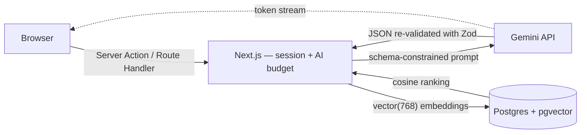

# Job Tracker 💼

[](https://github.com/nkieu-config/job-tracker-app-project/actions/workflows/ci.yml)
[](https://job-tracker-app-project.vercel.app)
[](LICENSE)


**The job hunt is a data problem. I built the tool to solve mine.** An AI-powered job-application tracker that analyzes job descriptions, scores your resume versions against them with vector embeddings, and tailors your bullets — built solo as my capstone project, used daily in my real job search.

**4 AI features · 11 app pages · 8-table Postgres schema · 218 tests + a 3-suite AI eval harness · ~10k lines of strict TypeScript**


## Try it in 60 seconds

**🔗 Live demo: [job-tracker-app-project.vercel.app](https://job-tracker-app-project.vercel.app)** — click **Try Live Demo** on the homepage, no signup.

| Field        | Value                  |
| ------------ | ---------------------- |
| **Email**    | `demo@jobtracker.app`  |
| **Password** | `demotracker2026`      |

Then open **Applications → Senior Backend Engineer (Acme Corp)**: the skill-gap chips show **5/6 skills matched** with Kubernetes flagged as the gap, **Resume fit** ranks three resume versions by cosine similarity (73% Strong fit on top), and **Tailor resume bullets** regenerates live, token by token.

> [!NOTE]
> The demo account is shared and public — anything you change is visible to other visitors until the nightly reseed, and all AI actions on it draw from one 30-calls-per-hour budget.

Prefer to run it yourself? Two commands and a `.env` — see [Quick start](#quick-start).

## Why I built this

I was a graduating student staring down my first job search, tracking twenty applications in a spreadsheet. Every new posting meant the same manual loop: re-read the job description, guess which skills I was missing, decide which of my three resume versions fit best, and rewrite my bullets to match — with no way to tell if any of it was working.

So for my graduation project I built the tool I wished I had: a tracker where the pipeline is a Kanban board instead of spreadsheet rows, and where the tedious parts — skill-gap analysis, resume-to-JD matching, bullet rewriting, interview prep — are done by AI in seconds instead of by me at 1 a.m.

The rule I held myself to: **an AI feature that isn't measured doesn't ship.** That's why this repo contains an evaluation harness with precision/recall numbers, not just prompts — and why I can tell you the semantic matching layer is worth exactly +8.3 points of recall.

The result is the app I now use to run the very job search it was built for. If you're reading this as a recruiter: the product *is* the cover letter.

## What happens when you analyze one job description

1. A Server Action re-verifies your session (middleware is never the only gate) and checks the per-user hourly AI budget before any model call.
2. `server/ai` calls Gemini with a JSON schema **derived from a Zod schema**, then re-validates the response with that same schema — malformed model output becomes a recoverable error message, never a crashed page.
3. Extracted skills are matched against your resumes in two layers: word-boundary + alias matching first, then embedding similarity for paraphrases — "GitHub Actions pipelines" counts as CI/CD. That second layer's contribution is measured, not assumed.
4. Computing fit embeds the JD and any new resume versions in one batched call, stores them in `vector(768)` columns, and ranks versions with a single cosine-distance SQL query behind an HNSW index.
5. Every model call is recorded — tokens and cost roll up per feature on an admin AI-usage page.



Full deep-dive — system design, decision rationale, challenges-and-solutions log: [docs/architecture.md](docs/architecture.md).

## Feature tour

| Module               | What it does                                                                                                                    |
| -------------------- | ------------------------------------------------------------------------------------------------------------------------------- |
| **Kanban pipeline**  | Drag-and-drop board (Saved → Applied → Interview → Offer → Rejected), optimistic updates, URL-synced list with search/filter/sort |
| **Dashboard**        | Response, interview and offer rates, pipeline funnel, upcoming deadlines                                                          |
| **JD analysis**      | Gemini extracts required skills, nice-to-haves and seniority, then flags which skills your resumes are missing                    |
| **Resume fit**       | Ranks every resume version against the JD by pgvector cosine similarity, labeled with Strong/Moderate/Weak bands                  |
| **Bullet tailoring** | Rewrites your experience into JD-tuned resume bullets, streamed token-by-token, saved per application                             |
| **Interview prep**   | Streamed prep sheet — likely technical and behavioral questions, each with what a strong answer covers                            |
| **Resume versions**  | PDF upload (content-type and magic-byte checked), text extraction, private Vercel Blob storage                                    |
| **AI observability** | Admin page tracking tokens and cost per AI feature; a shared hourly AI budget per user                                            |

The pipeline is a board, not a spreadsheet — drag a card and the move persists optimistically:


And the four AI features, all of them on one application:

| JD analysis & skill gap | Resume fit ranking |
| --- | --- |
|  |  |

| Bullet tailoring (streamed) | Interview prep (streamed) |
| --- | --- |
|  |  |

<details>
<summary>📸 One more — the landing page, before you sign in</summary>

The design system in [docs/design.md](docs/design.md), as actually rendered:


</details>

All screenshots are generated from the seeded demo by `npm run screenshots` (Playwright), so they never drift from the real UI.

## Engineering decisions I'd defend in an interview

- **The LLM is treated as untrusted input.** The JSON schema Gemini must follow is *derived from* a Zod schema, and the response is re-validated with that same schema — one source of truth for prompting and validation, defined once in `src/lib/schemas/`.
- **The AI is measured, not assumed.** An [evaluation harness](evals/) scores each AI feature with real metrics — precision/recall/F1 on skill extraction, a controlled ablation of the embedding layer, and an LLM-as-judge pass with a hallucination check on tailored bullets.
- **Defense-in-depth auth.** Middleware does an optimistic cookie check, but every page, Server Action and route handler independently re-verifies the session and scopes queries by `userId` — a design that survives CVE-2025-29927, the Next.js middleware bypass.
- **Vector search in the database, not the app.** Embeddings live in Postgres `vector(768)` columns behind an HNSW index; resume ranking is one raw-SQL cosine-distance query, not an application-side similarity loop.
- **AI behind one boundary.** All Gemini access lives in a single `server/ai/` module called only from server code, so the API key never reaches the client and there is exactly one place to meter, validate and mock.
- **Streaming end to end.** Gemini's chunk iterator is piped straight into a Route Handler `ReadableStream` → browser, with an end-of-stream status frame so a dropped connection can never silently persist a truncated result.
- **Production paper cuts, actually fixed.** Serverless connection pooling via the Neon driver adapter, a broken transitive kysely release pinned with an npm override, Prisma 7's engine removal, Next 16's `middleware` → `proxy` rename — the full list with solutions is in [docs/architecture.md](docs/architecture.md#challenges--solutions).

### AI eval scorecard

Regenerated with `npm run eval`, on real model calls:

- **Skill matching** — the embedding layer lifts recall from 86.1% to **94.4%** (+8.3 points; F1 90.5% → **95.5%**) over lexical-only matching, in a controlled ablation.
- **JD analysis** — **94.0% F1** on skill extraction (precision 94.8%, recall 93.4%), 93.3% seniority accuracy, **100% schema validity** across 15 labeled job descriptions.
- **Bullet tailoring** — LLM-as-judge scores of **5/5** on relevance, grounding and formatting with a **0% hallucination rate** on the items the free-tier daily quota allowed (3 of 6; excluded items are reported, never silently scored).

Full methodology and per-suite results: [evals/](evals/).

## Tech stack

| Layer     | Choice                                                                                      |
| --------- | -------------------------------------------------------------------------------------------- |
| Framework | Next.js 16 (App Router, Server Actions, Route Handlers) + TypeScript strict                  |
| AI        | Gemini 2.5 Flash + `gemini-embedding-001`, called in-process from `server/ai/`               |
| Database  | PostgreSQL (Neon) + Prisma 7 + pgvector                                                      |
| Auth      | Better Auth (sessions in Postgres)                                                           |
| UI        | Tailwind CSS v4, semantic design tokens ([design system](docs/design.md))                    |
| Storage   | Vercel Blob (private)                                                                        |
| Quality   | Zod validation end-to-end · Vitest + Testing Library · AI eval harness · Playwright tooling  |
| Infra     | Vercel + GitHub Actions                                                                      |

## Quick start

```bash
npm install
cp .env.example .env    # set DATABASE_URL, GEMINI_API_KEY, ...
npx prisma migrate dev
npm run dev             # http://localhost:3000
```

Optional demo data — with the dev server running:

```bash
npm run seed            # creates/resets the demo account with sample data
```

> [!NOTE]
> The seed only resets the demo account's own rows, so it is safe to re-run; other users' data is never touched.

Full environment-variable reference, scripts and deploy guide: [docs/setup.md](docs/setup.md) and [docs/deploy.md](docs/deploy.md).

## Testing & quality

218 tests across two Vitest projects — a **Node** project for server code (ownership scoping of every Server Action, the resume upload's blob lifecycle including compensating deletes, rate limiting, embedding batch splitting, the fence that keeps a job description from being read as prompt instructions) and a **jsdom** project for components (the streaming UI's save/discard rules, accessibility invariants of the drag-and-drop board). Four are rate-limit integration tests that run against a real Postgres and skip when no database is reachable. Security-critical modules — the prompt fence and the admin gate among them — are pinned to **100% coverage thresholds** in CI.

The AI layer is tested twice, at different altitudes: unit tests mock the SDK at the module boundary, and the [eval harness](evals/) measures the real model with precision/recall, an ablation and an LLM judge.

```bash
npm test                # both unit projects
npm run test:coverage   # with per-file thresholds
npm run eval            # AI eval suites (needs GEMINI_API_KEY)
npm run screenshots     # regenerate README screenshots via Playwright
```

## CI/CD

- **Every push and PR to `main`** — [CI](.github/workflows/ci.yml) runs lint → typecheck → all tests with coverage thresholds → a production build.
- **AI evals are deliberately not in push CI** — they call the real Gemini API, which costs quota. A [manual workflow](.github/workflows/eval.yml) runs any suite on demand and uploads the scorecard as an artifact; the pure metric functions are still unit-tested in every CI run.
- **Nightly** — [a scheduled workflow](.github/workflows/reseed-demo.yml) reseeds the shared demo account, so whatever visitors changed during the day rolls back to a fully populated state.
- **Deploy** — Vercel rebuilds and ships `main` automatically; the step-by-step Neon → Vercel setup is in [docs/deploy.md](docs/deploy.md).

## Documentation

| Doc                                          | What's inside                                          |
| -------------------------------------------- | ------------------------------------------------------- |
| [docs/architecture.md](docs/architecture.md) | System design, key decisions, challenges & solutions    |
| [docs/setup.md](docs/setup.md)               | Local setup, env vars, scripts, demo account            |
| [docs/deploy.md](docs/deploy.md)             | Step-by-step deploy: Neon → Vercel                      |
| [docs/manual-qa.md](docs/manual-qa.md)       | 14-step click-through smoke test                        |
| [evals/](evals/)                             | AI evaluation harness — methodology + scorecard         |
| [docs/design.md](docs/design.md)             | Design system: tokens, typography, components           |

## Honest limitations

Deliberate scope choices for a portfolio-scale deployment:

- **The tailoring eval is a 3-of-6 sample** — the Gemini free tier caps generation at 20 requests/day, and running jd-analysis (15 calls, captured in full) first left only part of a day's budget; the remaining items need a paid key or another day's quota.
- **No browser e2e suite yet** — the Playwright foundation exists (login/settle helpers in `e2e/`, already driving the automated screenshots) but specs haven't been written on it.
- **Email/password auth only** — no OAuth providers.
- **PDF text extraction only** — scanned or image-based PDFs yield no text, and the app asks for a readable file instead of OCR-ing it.

Next on the roadmap: a Playwright e2e suite on the existing helpers, a fully captured scorecard on a paid Gemini key, and OAuth sign-in.

## About

Built solo by [Natthachak (@nkieu-config)](https://github.com/nkieu-config) — a new-grad software developer who likes building products end to end, from the Postgres schema to the streaming UX. This is my graduation capstone and the tool behind my own job search.

📫 [natthachak.config@gmail.com](mailto:natthachak.config@gmail.com)

If you're hiring — [try the demo](https://job-tracker-app-project.vercel.app), then let's talk.

> [!IMPORTANT]
> © 2026 Natthachak Jeungraksareechai — all rights reserved. This code is public so you can read it as a work sample; it is **not** licensed for reuse. Please don't copy it or submit it as your own. See [LICENSE](LICENSE).
