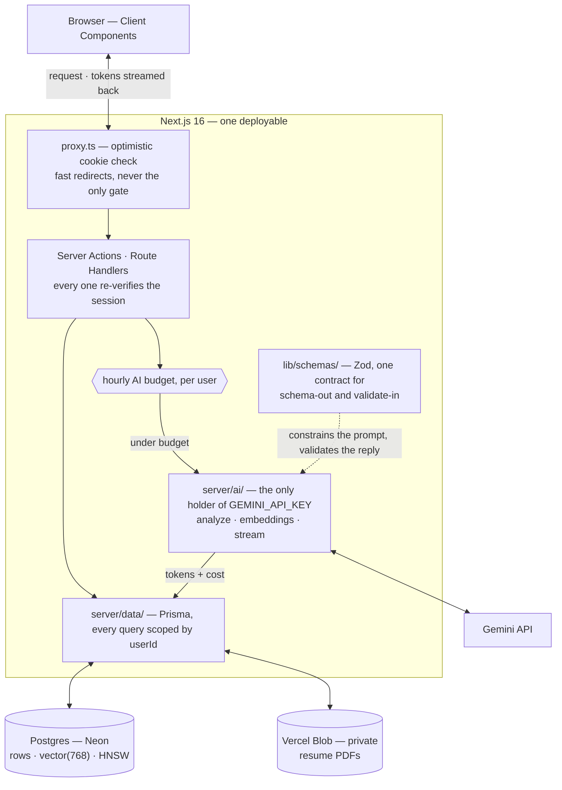

# Architecture

How the system is put together, and the reasoning behind the key decisions.
The constraints that shaped it: one developer, a serverless host (Vercel), a
free-tier Gemini quota, and a portfolio-scale deployment whose real users are me
and demo visitors. Several decisions below are direct consequences of those
constraints.

## Goals and non-goals

### Goals

- Every AI feature is measured before it ships — precision/recall, an ablation,
  or a judged rubric ([evals/](../evals/)).
- No secret ever reaches the browser; every entry point independently
  re-verifies the session and scopes queries by `userId`.
- One deployable, one database, one `.env` — operable by one person.
- Sessions revoke immediately (rows in Postgres, not JWTs); resume PDFs are
  never publicly addressable.

### Non-goals

- OAuth sign-in, OCR of scanned PDFs, and a browser e2e suite — deliberately
  deferred; tracked in the README's
  [Honest limitations](../README.md#honest-limitations).
- Scale beyond portfolio traffic. The hourly AI budget and the `max: 5` pool are
  sized for tens of users, not thousands, and that is a choice.
- Multi-model support. One vendor covers generation and embeddings; a provider
  abstraction would be speculation with a single consumer.

## System overview

The README's diagram traces one AI request end to end. This one is the same
system with the gates and seams drawn in — where a request is authorized, where
it is metered, and which modules are allowed to hold a secret.



- **One Next.js service.** Server Actions and Route Handlers handle UI, sessions, database access, file upload, rate limiting, and the AI calls. `GEMINI_API_KEY` is read only inside `server/ai/` and is never sent to the browser.
- **`server/ai/` module.** `analyze` (structured JSON), `embeddings` (batch), and `stream` (token-by-token bullet tailoring + interview prep). All three return domain values and throw `AiError` — none of them knows what HTTP is. The heavy Gemini logic sits behind one boundary; the rest of the app imports a thin facade (`server/ai-client.ts`).
- **Zod schemas** in `src/lib/schemas/` are the single source of truth for the AI contract — used both to constrain the model (schema-out) and to validate its response (validate-in).

## Project layout

```text
applywise/                   # a single Next.js 16 app
├── src/
│   ├── app/                 # App Router (routes) + Route Handlers
│   ├── components/          # UI by domain (auth, applications, resumes…)
│   │   └── ui/              # primitives + the Tailwind class helpers they use
│   ├── actions/             # Server Actions
│   ├── server/              # everything with a secret, a side effect, or a DB
│   │   ├── ai/  data/       # every module starts with `import "server-only"`
│   │   └── workflows/       # multi-step AI flows the actions call into
│   ├── lib/                 # pure, side-effect-free, safe on both sides
│   │   ├── schemas/         # Zod contracts
│   │   └── constants/
│   └── generated/prisma/    # Prisma client (generated, gitignored)
├── prisma/                  # schema + migrations
├── evals/                   # AI evaluation harness
├── tests/                   # mirrors src/
├── e2e/                     # Playwright suites (smoke, mutations, axe)
├── docs/
└── scripts/
```

## Data model

Eight Prisma models in two groups.

**Auth — owned by Better Auth.** `User`, `Session`, `Account`, `Verification`:
the standard email/password session tables. Sessions live in Postgres, not in a
JWT, so a sign-out revokes immediately.

**Domain.**

| Model | Holds | Notes |
| --- | --- | --- |
| `Application` | One job in the pipeline: company, role, `status`, deadline, the JD text, and the structured `analysis` JSON | Also carries the JD's `vector(768)` embedding plus the streamed artifacts saved per application — tailored bullets and the interview-prep sheet |
| `ResumeVersion` | A labeled resume: the private Blob URL, the extracted text, and its `vector(768)` embedding | Resume fit ranks these against `Application.jdEmbedding` |
| `AiUsage` | One row per model call: feature, model, prompt/output tokens, latency, ok | Cost is **not** stored — the admin page derives it from token counts at read time, so a price change never rewrites history |
| `RateLimit` | An expiring counter keyed by `key` | Backs both the hourly AI budget and auth throttling; the atomic upsert is covered by an integration test |

`Application` and `ResumeVersion` carry a `userId` and cascade on user delete;
every query against them is scoped by that `userId` — the same rule
[Defense-in-depth auth](#defense-in-depth-auth) enforces at the entry points.
`RateLimit` is the one table keyed by an opaque string rather than a user row,
because it also throttles sign-in attempts, which happen before a user is known.

Both embedding columns are declared `Unsupported("vector(768)")` — see
[pgvector via raw SQL](#pgvector-via-raw-sql) for how they are written, indexed,
and the sharp edge that comes with them.

## Key decisions

### Why `src/server/` exists, and why the compiler enforces it

The split is not filing. A Client Component that imports `prisma` ships a
database driver — and potentially a connection string — to the browser. Nothing
in a folder name prevents that, so every module under `src/server/` opens with
`import "server-only"`, and `next build` fails with the offending file named if a
Client Component ever reaches one. `src/lib/auth-client.ts` carries the mirror
guard, `client-only`.

The rule that decides where a module goes: **does it touch a secret, a database,
the network, or `process.env`?** If yes it is `server/`. If it is a pure function
or a Zod schema, it is `lib/` and both sides may import it. If it returns Tailwind
classes, it belongs with the components that render them.

The boundary pays for itself immediately. `ApplicationSort` used to live beside
the Prisma queries in `data/applications.ts`, so `list-controls.tsx` could not
import the `APPLICATION_SORTS` constant without dragging Prisma into the client
bundle — and duplicated the three sort values as string literals instead. Moving
the type into `lib/schemas/` deleted the duplicate.

`server-only` throws unless the bundler resolves it under the `react-server`
export condition, which only Next sets. Vitest aliases it to the no-op that
condition would have picked; `npm run eval` and the scripts pass
`--conditions=react-server`. The guard therefore holds exactly where it must —
in the bundle that reaches a browser.

`server-only` catches a Client Component reaching into `server/`, but says
nothing about layer *ordering* — `eslint.config.mjs` adds that half: `src/lib`
may not import `@/server`, `src/components` may not either (not even a type),
and `@/server/prisma` is reachable only from `src/server/data/`, the Better Auth
adapter, and the rate limiter.

### Why this is a single app (and was briefly a monorepo)

The repo went through a deliberate arc, visible in the git history:

1. **Monorepo + Turborepo** — introduced when the system was two deployables
   (Next.js + an Express AI service) that shared a validation contract. A
   monorepo with `packages/shared` (Zod schemas) and `packages/db` (Prisma)
   earned its place: it kept one source of truth across two apps and let
   Turborepo cache/parallelise their tasks.
2. **Collapsed back to a single Next.js app** — once the Express service was
   folded in-process, `shared` and `db` had a single consumer, so the workspace
   split, the `@job-tracker/*` package boundaries, and Turborepo were all
   ceremony without a payoff. They were removed; schemas moved to
   `src/lib/schemas/`, Prisma to `prisma/` + `src/generated/`.

The point isn't monorepo-vs-not — it's that structure should track the shape of
the system. Complexity was added when two services justified it and removed when
one didn't.

### Why the AI runs in-process (and not as a separate service)

This started as a separate Express microservice and was later folded into the Next.js app. The honest trade-off:

- **What the split bought:** the Gemini key lived in its own process, and the AI worker could scale/deploy independently.
- **What it cost:** an extra network hop, a second deployment target, a shared-key auth scheme to maintain, and a two-process local dev loop — all to wrap a handful of I/O-bound Gemini SDK calls.
- **Why in-process wins here:** the key is server-only either way (Server Actions and Route Handlers never reach the browser), the AI work is I/O-bound not CPU-bound (a separate process buys no isolation the event loop doesn't already give), and Route Handlers stream a `ReadableStream` just as well as Express. Removing the hop cut latency and the operational surface without weakening the security boundary.

The AI code is still isolated **as a module** (`server/ai/`) rather than a service, so the boundary is preserved where it adds value (one place owns the key and the prompts) and dropped where it only added ceremony.

### Why pgvector (and not a dedicated vector store)

Embeddings are queried in exactly one way — rank a user's resume versions against
one job description — over row counts a single Postgres instance handles
trivially. A dedicated vector database would add a second system to provision,
secure, and keep consistent with the relational rows, to answer a query pgvector
expresses as one SQL statement against the tables the rest of the app already
uses.

### Why Better Auth

Auth is a **library here, not a service**. Better Auth's tables are generated
into my own schema through `prismaAdapter`, so `User`, `Session`, `Account` and
`Verification` are ordinary rows next to `Application` and `ResumeVersion` —
same database, same migrations, same `userId` the rest of the app scopes by.
Sessions are rows rather than JWTs, so a sign-out revokes immediately instead of
waiting out a token's expiry, and password reset and email verification are
config hooks (`sendResetPassword`, `sendVerificationEmail`) rather than screens
rented from a vendor.

The deciding property, in hindsight, is that its parts come apart. Better Auth's
default rate limiting keeps its counters in memory, which is worthless on a host
that gives each request its own instance — so the store is swapped for
`postgresRateLimitStorage`, and the throttle survives because the counter lives
in the database like everything else. A hosted auth provider would have left me
with whatever throttle it shipped.

### Defense-in-depth auth

A `proxy.ts` (Next 16's renamed middleware) does an optimistic cookie check for fast redirects, but it is **never the only gate**: every page, Server Action, and route handler independently re-checks the session and scopes its queries by `userId`. This design directly addresses CVE-2025-29927, where Next.js middleware could be bypassed entirely — here, bypassing the middleware gains an attacker nothing.

### Two-layer AI validation

The JSON schema Gemini must follow is derived from a Zod schema (`z.toJSONSchema`), and the response is re-validated with that same Zod schema on the way back in. Malformed model output becomes an explicit, recoverable `AiError` instead of a runtime crash somewhere in the UI. Schema-out, validate-in — the model is treated as an untrusted external system.

### pgvector via raw SQL

Vector columns are declared as `Unsupported("vector(768)")` in the Prisma schema, so Prisma tracks them in migrations without schema drift, while embeddings are written and ranked with raw SQL — cosine distance via the `<=>` operator over an HNSW index. Resume fit scores are a single ranked query, not an application-side loop.

That index has one sharp edge. Prisma cannot express it — `type: Hnsw` is not a valid Prisma index type — so it exists only inside a migration. `prisma migrate dev` diffs `schema.prisma` against the database, doesn't find the index in the schema, and emits a `DROP INDEX` for it. That is exactly how it silently disappeared once already (`20260607150607_add_rate_limit`), leaving fit scoring on a sequential scan. **If a generated migration drops `resume_version_embedding_hnsw_idx`, delete that line before applying it.**

### Streaming UX

Bullet tailoring and interview prep stream token-by-token, so output starts
appearing as soon as the model produces its first tokens instead of landing all
at once when generation finishes.

The transport is split from the generation. `server/ai/stream.ts` returns an
`AsyncIterable<string>` of tokens and throws `AiError` — the same contract
`analyze` and `embeddings` present behind the same seam, so a caller never has to
ask which half of `server/ai` it is talking to. Everything HTTP-shaped lives in
`lib/stream-protocol.ts`: the Route Handler wraps the token iterable in a web
`ReadableStream`, maps an `AiError` to a status, and appends the end-of-stream
status frame that lets the browser tell a completed generation from a dropped
connection — so a truncated result can never be silently saved.

**The wire format.** The response is `text/plain`: raw model tokens, then one
terminal frame — a NUL sentinel (`\u0000`, a character model output can never
contain) followed by a JSON status.

```text
…streamed tokens…\u0000{"ok":true}
…streamed tokens…\u0000{"ok":false,"error":"The AI response was interrupted before it finished."}
```

No terminal frame at all means the connection dropped. A failure *before* the
first token is an ordinary HTTP error instead, with the `AiError` kind choosing
the status: `config` → 503, `timeout` → 504, and `transport` / `empty` /
`malformed` / `schema` → 502.

That split is newer than the streaming itself. `stream.ts` used to return
`Response` objects carrying invented 502/503 statuses — a fossil of the Express
service that was folded in-process. It made a module that opens no socket speak
HTTP, and the cost landed far from the cause: the Route Handler unwrapped the
`Response` only to rebuild an identical one, and the eval harness had to hand-write
a `Response`-to-`AiError` adapter that guessed every non-ok status as `transport`
— so a missing API key was retried three times with backoff before failing.

### Per-request data efficiency

- The session lookup is memoized with `React.cache`, so a request costs one Better Auth call instead of one per layout + page.
- Independent reads on a page are fetched with `Promise.all` instead of waterfalling.

### Private resume storage

Resume PDFs live in a **private** Vercel Blob store and are streamed only through an authenticated, ownership-scoped route handler. The blob URL is never exposed publicly.

## Testing & rollout

The AI layer is tested at two altitudes: unit tests mock the Gemini SDK at the
module boundary, and the [eval harness](../evals/) measures the real model with
precision/recall, a controlled ablation, and an LLM judge. Security-critical
modules — the prompt fence, the admin gate, the AI ownership guard, the PDF page
cap — carry 100% coverage thresholds in CI. The full breakdown is in the
[README](../README.md#testing--quality).

CI runs two jobs in parallel. `verify` is the fast one — lint, typecheck, the
unit and integration suites against a `pgvector` container, a drift guard on the
test counts the README advertises, and a production build. `e2e` is the slow
one: it builds the app, starts it against a throwaway Postgres, seeds the demo
account through the running server, and drives Playwright over it, accessibility
suite included. Splitting them means a red cross names which half broke, and it
puts the axe gate somewhere it actually runs.

Rollout is Vercel shipping `main` once CI passes. Migrations are developed
against the Neon `dev` branch and applied to `production` with
`prisma migrate deploy` — Vercel does not run it for you, and a merge that ships
code ahead of its migration takes production down. The step-by-step flow,
including the HNSW caveat above, is in the [deploy guide](deploy.md).

## Challenges & solutions

| Challenge | Solution |
| --- | --- |
| **Prisma 7 dropped the bundled query engine** | Prisma schema + migrations live in `prisma/`; the client generates into `src/generated/` and is configured via `prisma.config.ts`. |
| **Connection exhaustion in serverless** | On classic Vercel functions each request got its own isolated instance, so every instance opened its own `pg` pool and Postgres ran out of connections (plus TLS/SNI routing issues from a misplaced `-pooler` suffix). The fix at the time was `@neondatabase/serverless` + `@prisma/adapter-neon`, pooling natively over WebSocket. **Since moving to Vercel Fluid compute** — which keeps instances warm and reuses TCP across requests — the app is back on `pg` + `@prisma/adapter-pg`, which is what Neon now recommends for Fluid. Exhaustion is held off by three things the original setup lacked: `attachDatabasePool` from `@vercel/functions` (drains idle connections before an instance suspends), a `max: 5` cap per instance, and the PgBouncer `-pooler` endpoint fronting it all. |
| **Better Auth pulled a broken Kysely** | Kysely `0.29.2` stopped re-exporting a symbol the adapter imports; pinned to `0.28.17` via an npm `override`. **Revisit when Better Auth's peer range drops `^0.28`** — the pin is invisible until it blocks an upgrade, so check it whenever `better-auth` itself is bumped. |
| **Vulnerable transitives with no direct upgrade** | `npm audit` reported four highs — libvips CVEs through `sharp`, and two postcss advisories — all reached through Next's own dependency tree, where the only "fix" npm offers is downgrading Next by seven majors. `find-my-way` arrived the same way through the Prisma CLI. Each is patched upstream in a release Next and Prisma simply have not bumped to yet, so the three are lifted with npm `overrides` (`sharp ^0.35.3`, `postcss ^8.5.22`, `find-my-way ^9.7.0`) and the build, the unit suite and the browser suite all run against the lifted versions. **Drop each override once the parent's own range covers it** — an override that has become a no-op is a version pin nobody asked for. |
| **Next 16 renamed `middleware` → `proxy`** | Read the bundled Next docs and adopted the new `proxy.ts` convention — which also reinforced the decision to keep auth checks in the data layer. |
| **AI output can't be trusted** | The Zod round-trip (schema-out, validate-in) makes off-schema Gemini responses an explicit, recoverable failure instead of a page crash. |
| **Resume privacy** | Private Blob store + authenticated streaming route; no public URLs. |

## Accepted trade-offs

Known, deliberate limits — recorded so they read as decisions rather than oversights.

- **Resource caps are checked, then written, without a transaction.** `MAX_APPLICATIONS` and `MAX_RESUME_VERSIONS` count before inserting, so two concurrent requests can overshoot the cap slightly. Only a user's own quota is affected, the overshoot is bounded by request concurrency, and closing it would put a transaction on the hot path of every create. Revisit if caps ever gate something billable per row.
- **Deleting a resume removes the blob before the row.** If the row delete then fails, the row survives pointing at a blob that is gone and the file route 404s — recoverable by deleting again. The inverse order would instead orphan a blob that nothing references and nothing bills against a user, which is the harder leak to notice. The row is what the user sees, so the row wins.
- **Deadline tone is computed on the UTC day, not the viewer's.** `deadlineTone` derives "today" from the UTC date, and every deadline is rendered with `timeZone: "UTC"`, so the display is internally consistent. A viewer west of UTC can still see "overdue" up to a day before their own wall clock agrees. Fixing it means passing the client timezone into an otherwise static server render; the inconsistency is cosmetic, so it stays.
- **Email verification is implemented but not enforced.** The verification mail, the token expiry and the sign-in handling for `EMAIL_NOT_VERIFIED` are all wired up, but `requireEmailVerification` stays off until production has a Resend sender on a verified domain. Better Auth runs `sendVerificationEmail` through a background-task wrapper that swallows failures, so enforcing verification while `sendEmail` cannot deliver would let every signup succeed and then lock the account out with no way back. Enabling it is a one-line change once the sender exists; until then the exposure it would close — disposable accounts drawing on the AI and upload budgets — is bounded by the per-user hourly limits that are already enforced.
- **Account deletion is not exposed over HTTP.** Better Auth's `deleteUser` endpoint stays disabled; accounts are removed with `npm run delete-user`, which deletes the user's resume blobs before the row so nothing is stranded. Deleting a user row directly in the database still leaks its blobs — the script is the supported path.

## Open questions

- **The tailoring eval is still a 3-of-6 sample.** Completing it needs a paid
  Gemini key or another day's free-tier quota.
- **The action layer has two return conventions and one workflow gap.** Actions
  consumed by `useActionState` return a named `*State`; those called imperatively
  return `{ error?: string }`. Both are deliberate, but the workflow layer is
  genuinely half-adopted: `analyzeApplication` and `computeResumeFit` route
  through `server/workflows/`, while `autofillFromJd` and `generatePipelineCoach`
  inline the same orchestration — and the streaming routes cannot use workflows
  at all, because those return a stream rather than a `WorkflowResult`. Deciding
  what the workflow layer is *for* comes before any refactor.
- **`src/server/` root is 19 flat files** mixing infrastructure, policy, auth,
  domain and I/O, while `ai/`, `data/` and `workflows/` subdirectories already
  exist. Splitting it would rewrite imports repo-wide, and the lint rules now key
  off paths, so the reshuffle needs care rather than enthusiasm.
- **Several UI atoms are hand-rolled at multiple call sites** — a progress
  track+fill in five places, three of which clamp no minimum width while the
  other two clamp to different floors; an error paragraph in eleven with two
  different background tokens; and a status dot at eight sites in two sizes
  despite `Dot` existing and being used at only two.

## Related docs

- [Setup & scripts](setup.md)
- [Deploy guide](deploy.md)
- [Manual QA checklist](manual-qa.md)
- [Design system](design.md)
