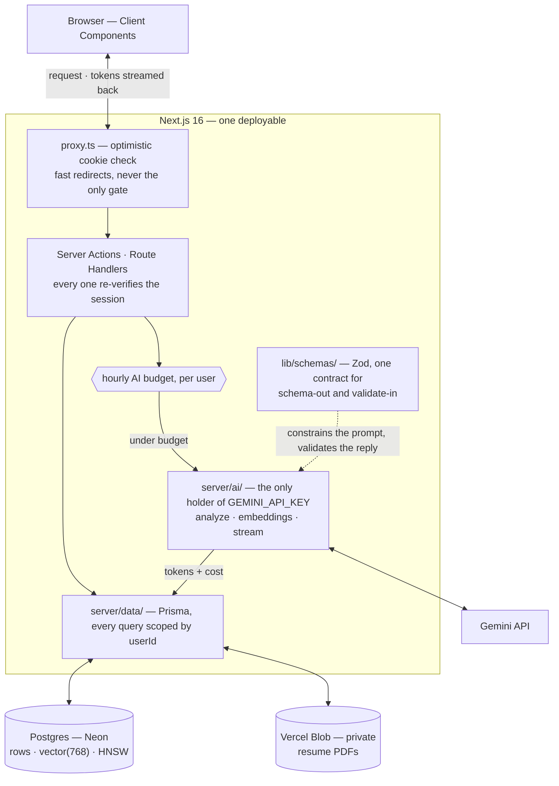

# Architecture

How the system is put together, and the reasoning behind the key decisions.

## System overview

The README's diagram traces one AI request end to end. This one is the same
system with the gates and seams drawn in — where a request is authorized, where
it is metered, and which modules are allowed to hold a secret.



- **One Next.js service.** Server Actions and Route Handlers handle UI, sessions, database access, file upload, rate limiting, and the AI calls. `GEMINI_API_KEY` is read only inside `server/ai/` and is never sent to the browser.
- **`server/ai/` module.** `analyze` (structured JSON), `embeddings` (batch), and `stream` (token-by-token bullet tailoring + interview prep). All three return domain values and throw `AiError` — none of them knows what HTTP is. The heavy Gemini logic sits behind one boundary; the rest of the app imports a thin facade (`server/ai-client.ts`).
- **Zod schemas** in `src/lib/schemas/` are the single source of truth for the AI contract — used both to constrain the model (schema-out) and to validate its response (validate-in).

## Project layout

```text
job-tracker/                 # a single Next.js 16 app
├── src/
│   ├── app/                 # App Router (routes) + Route Handlers
│   ├── components/          # UI by domain (auth, applications, resumes…)
│   │   └── ui/              # primitives + the Tailwind class helpers they use
│   ├── actions/             # Server Actions
│   ├── server/              # everything with a secret, a side effect, or a DB
│   │   ├── ai/  data/       # every module starts with `import "server-only"`
│   ├── lib/                 # pure, side-effect-free, safe on both sides
│   │   ├── schemas/         # Zod contracts
│   │   └── constants/
│   └── generated/prisma/    # Prisma client (generated, gitignored)
├── prisma/                  # schema + migrations
├── evals/                   # AI evaluation harness
├── tests/                   # mirrors src/
├── docs/
└── scripts/
```

## Key decisions

### Why `src/server/` exists, and why the compiler enforces it

The split is not filing. A Client Component that imports `prisma` ships a
database driver — and potentially a connection string — to the browser. Nothing
in a folder name prevents that, so every module under `src/server/` opens with
`import "server-only"`, and `next build` fails with the offending file named if a
Client Component ever reaches one. `src/lib/auth-client.ts` carries the mirror
guard, `client-only`.

The rule that decides where a module goes: **does it touch a secret, a database,
the network, or `process.env`?** If yes it is `server/`. If it is a pure function
or a Zod schema, it is `lib/` and both sides may import it. If it returns Tailwind
classes, it belongs with the components that render them.

The boundary pays for itself immediately. `ApplicationSort` used to live beside
the Prisma queries in `data/applications.ts`, so `list-controls.tsx` could not
import the `APPLICATION_SORTS` constant without dragging Prisma into the client
bundle — and duplicated the three sort values as string literals instead. Moving
the type into `lib/schemas/` deleted the duplicate.

`server-only` throws unless the bundler resolves it under the `react-server`
export condition, which only Next sets. Vitest aliases it to the no-op that
condition would have picked; `npm run eval` and the scripts pass
`--conditions=react-server`. The guard therefore holds exactly where it must —
in the bundle that reaches a browser.

### Why this is a single app (and was briefly a monorepo)

The repo went through a deliberate arc, visible in the git history:

1. **Monorepo + Turborepo** — introduced when the system was two deployables
   (Next.js + an Express AI service) that shared a validation contract. A
   monorepo with `packages/shared` (Zod schemas) and `packages/db` (Prisma)
   earned its place: it kept one source of truth across two apps and let
   Turborepo cache/parallelise their tasks.
2. **Collapsed back to a single Next.js app** — once the Express service was
   folded in-process, `shared` and `db` had a single consumer, so the workspace
   split, the `@job-tracker/*` package boundaries, and Turborepo were all
   ceremony without a payoff. They were removed; schemas moved to
   `src/lib/schemas/`, Prisma to `prisma/` + `src/generated/`.

The point isn't monorepo-vs-not — it's that structure should track the shape of
the system. Complexity was added when two services justified it and removed when
one didn't.

### Why the AI runs in-process (and not as a separate service)

This started as a separate Express microservice and was later folded into the Next.js app. The honest trade-off:

- **What the split bought:** the Gemini key lived in its own process, and the AI worker could scale/deploy independently.
- **What it cost:** an extra network hop, a second deployment target, a shared-key auth scheme to maintain, and a two-process local dev loop — all to wrap a handful of I/O-bound Gemini SDK calls.
- **Why in-process wins here:** the key is server-only either way (Server Actions and Route Handlers never reach the browser), the AI work is I/O-bound not CPU-bound (a separate process buys no isolation the event loop doesn't already give), and Route Handlers stream a `ReadableStream` just as well as Express. Removing the hop cut latency and the operational surface without weakening the security boundary.

The AI code is still isolated **as a module** (`server/ai/`) rather than a service, so the boundary is preserved where it adds value (one place owns the key and the prompts) and dropped where it only added ceremony.

### Defense-in-depth auth

A `proxy.ts` (Next 16's renamed middleware) does an optimistic cookie check for fast redirects, but it is **never the only gate**: every page, Server Action, and route handler independently re-checks the session and scopes its queries by `userId`. This design directly addresses CVE-2025-29927, where Next.js middleware could be bypassed entirely — here, bypassing the middleware gains an attacker nothing.

### Two-layer AI validation

The JSON schema Gemini must follow is derived from a Zod schema (`z.toJSONSchema`), and the response is re-validated with that same Zod schema on the way back in. Malformed model output becomes an explicit, recoverable `AiError` instead of a runtime crash somewhere in the UI. Schema-out, validate-in — the model is treated as an untrusted external system.

### pgvector via raw SQL

Vector columns are declared as `Unsupported("vector(768)")` in the Prisma schema, so Prisma tracks them in migrations without schema drift, while embeddings are written and ranked with raw SQL — cosine distance via the `<=>` operator over an HNSW index. Resume fit scores are a single ranked query, not an application-side loop.

That index has one sharp edge. Prisma cannot express it — `type: Hnsw` is not a valid Prisma index type — so it exists only inside a migration. `prisma migrate dev` diffs `schema.prisma` against the database, doesn't find the index in the schema, and emits a `DROP INDEX` for it. That is exactly how it silently disappeared once already (`20260607150607_add_rate_limit`), leaving fit scoring on a sequential scan. **If a generated migration drops `resume_version_embedding_hnsw_idx`, delete that line before applying it.**

### Streaming UX

Bullet tailoring and interview prep stream token-by-token, so the user sees output begin in under a second instead of staring at a spinner for ten.

The transport is split from the generation. `server/ai/stream.ts` returns an
`AsyncIterable<string>` of tokens and throws `AiError` — the same contract
`analyze` and `embeddings` present behind the same seam, so a caller never has to
ask which half of `server/ai` it is talking to. Everything HTTP-shaped lives in
`lib/stream-protocol.ts`: the Route Handler wraps the token iterable in a web
`ReadableStream`, maps an `AiError` to a status, and appends the end-of-stream
status frame that lets the browser tell a completed generation from a dropped
connection — so a truncated result can never be silently saved.

That split is newer than the streaming itself. `stream.ts` used to return
`Response` objects carrying invented 502/503 statuses — a fossil of the Express
service that was folded in-process. It made a module that opens no socket speak
HTTP, and the cost landed far from the cause: the Route Handler unwrapped the
`Response` only to rebuild an identical one, and the eval harness had to hand-write
a `Response`-to-`AiError` adapter that guessed every non-ok status as `transport`
— so a missing API key was retried three times with backoff before failing.

### Per-request data efficiency

- The session lookup is memoized with `React.cache`, so a request costs one Better Auth call instead of one per layout + page.
- Independent reads on a page are fetched with `Promise.all` instead of waterfalling.

### Private resume storage

Resume PDFs live in a **private** Vercel Blob store and are streamed only through an authenticated, ownership-scoped route handler. The blob URL is never exposed publicly.

## Challenges & solutions

| Challenge | Solution |
| --- | --- |
| **Prisma 7 dropped the bundled query engine** | Prisma schema + migrations live in `prisma/`; the client generates into `src/generated/` and is configured via `prisma.config.ts`. |
| **Connection exhaustion in serverless** | On classic Vercel functions each request got its own isolated instance, so every instance opened its own `pg` pool and Postgres ran out of connections (plus TLS/SNI routing issues from a misplaced `-pooler` suffix). The fix at the time was `@neondatabase/serverless` + `@prisma/adapter-neon`, pooling natively over WebSocket. **Since moving to Vercel Fluid compute** — which keeps instances warm and reuses TCP across requests — the app is back on `pg` + `@prisma/adapter-pg`, which is what Neon now recommends for Fluid. Exhaustion is held off by three things the original setup lacked: `attachDatabasePool` from `@vercel/functions` (drains idle connections before an instance suspends), a `max: 5` cap per instance, and the PgBouncer `-pooler` endpoint fronting it all. |
| **Better Auth pulled a broken kysely** | kysely `0.29.2` stopped re-exporting a symbol the adapter imports; pinned to `0.28.17` via an npm `override`. |
| **Next 16 renamed `middleware` → `proxy`** | Read the bundled Next docs and adopted the new `proxy.ts` convention — which also reinforced the decision to keep auth checks in the data layer. |
| **AI output can't be trusted** | The Zod round-trip (schema-out, validate-in) makes off-schema Gemini responses an explicit, recoverable failure instead of a page crash. |
| **Resume privacy** | Private Blob store + authenticated streaming route; no public URLs. |

## Related docs

- [Setup & scripts](setup.md)
- [Deploy guide](deploy.md)
- [Manual QA checklist](manual-qa.md)
- [Design system](design.md)
